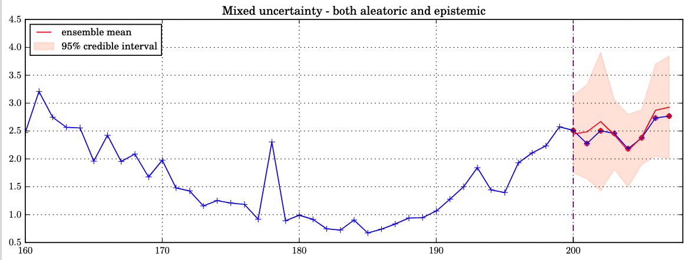
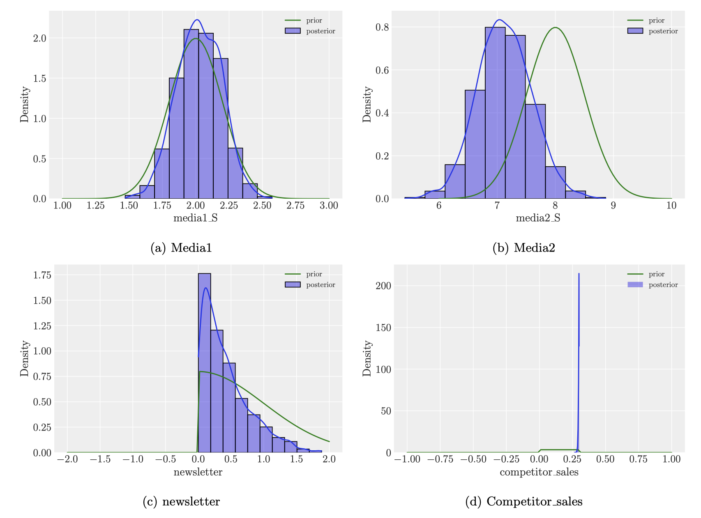

KTP_Croud
==============================

Codes for KTP_Croud assessment tasks.

> **Note** We follow the `Cookiecutter` [data science template](https://drivendata.github.io/cookiecutter-data-science/) to facilitate understanding the code structure. Check out its directory structure to get around. Data has not been uploaded for privacy reasons. To test the codes with minimum changes, put the data into the directory `data/raw/xxx.csv`. Check out [visualization](/visualization) for produced figures.

### part 1 predictive modelling

Several models themed on Bayesian or temporal-pattern are learned. Different sources of uncertainty (aleatoric or epistemic) are accounted for given the limited size of data. Refer to [predctive models](src/modelling/part1_modelling.ipynb)

### part 2 Bayesian methods

Informative priors are specified according to certain *a priori* scientific/expert knowledge. Posteriors are updated given the data. Refer to [prior elicitation](src/modelling/part2_prior_choice.ipynb).

